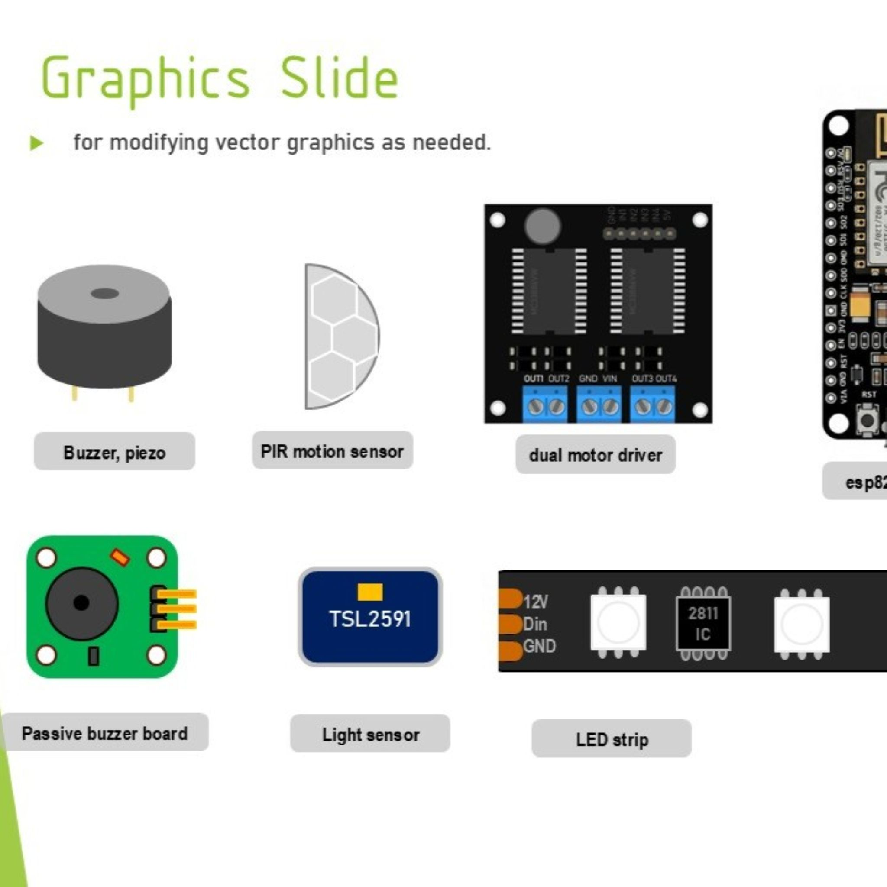
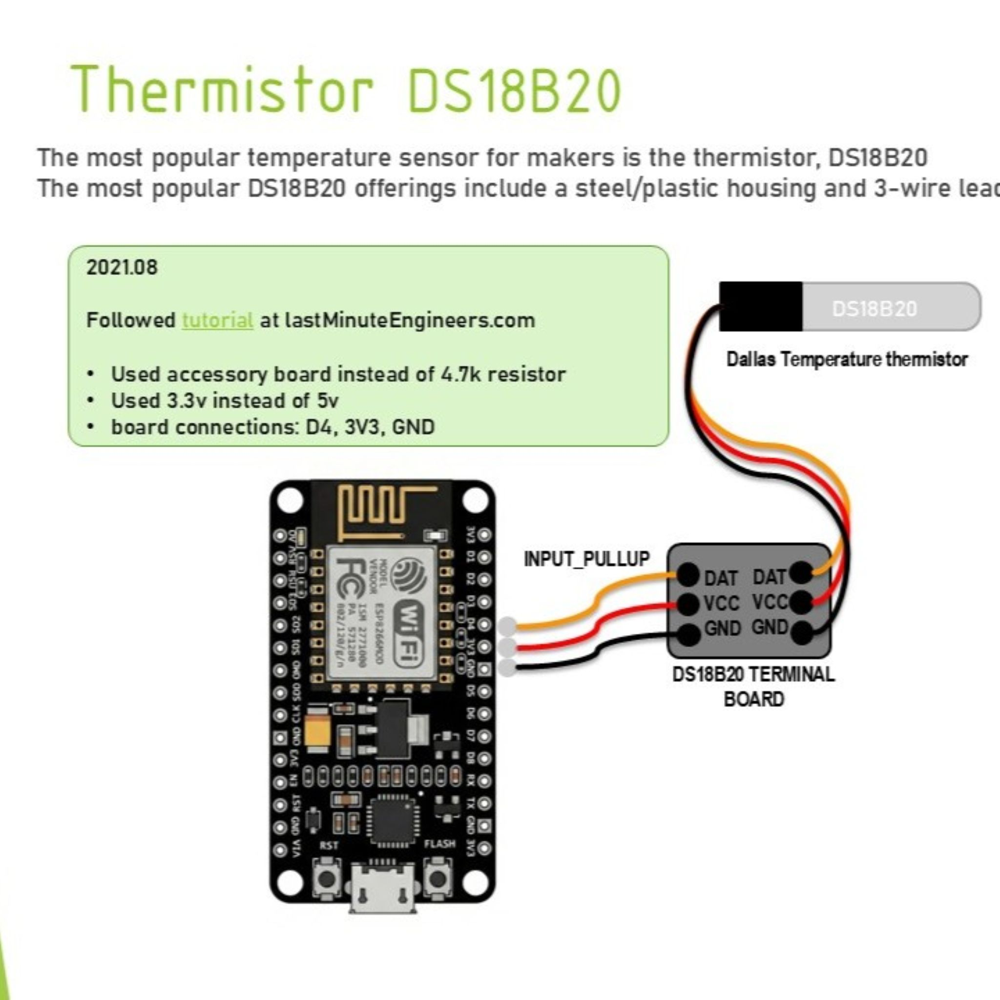
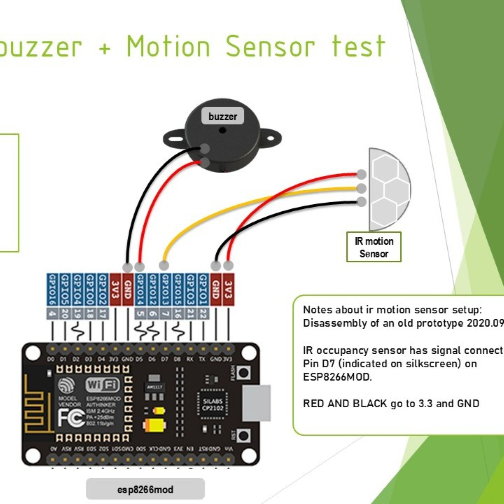

## MCU Designs

(December 2025) I am posting a compilation of microcontrollers & sensors documents, mainly diagrams, from my self-study and device trials.  This is nearly 10 years of self-study packaged in one PDF.  But, I'm also sharing the source files in PPTX so you can neatly make notes for your own projects. While I tested out popular sensors and MCUs between 2016 and 2025 I wrote my own notes to record the wiring layouts.  Now, we can use AI to enhance these for the first time ever.  So, I made some minor improvements to reach a quality level worth sharing. Specifically, it's very challenging to produce clean images of the microcontrollers, which you find on many tutorial sites like LastMinuteEngineers where the quality of the diagram is the difference between a successful trial and another confusing waste of time.

* Download the [Diagrams PDF (53 slides, 5mb)](https://github.com/MXET/resources/blob/a1f77c870dd3d441110d524be8c15b135d15957b/doc/2025_ESP_Diagrams.pdf)
* Download the [diagrams source files, pptx, drawio](https://github.com/MXET/resources/blob/a1f77c870dd3d441110d524be8c15b135d15957b/doc/2025_ESP_Diagrams.zip)

- 
- 
- 

**Purpose**
(copied from the PDF) This document is a consolidated pack of my notes for self-study of wireless IoT microcontrollers and integration of sensors.
For each sensor I wished to test & understand, I built my own setup, usually following a guide online.  Some designs have pivoted from the examples to reach new outcomes, and I needed to take my notes visually to record how the devices are setup.
For those self-teaching with sensors:
* Use this PPTX to have a collection of clean graphics and an easy way to draw your wiring configurations.
* With this template, you can record a step that may have taken 2 hours of troubleshooting, in 10 seconds.
* In the end, you will thank yourself for years to come if you perform your own projects with records and save time on the next projects.
* December 2025 is the first time I considered publishing this document which had been very messy and never complete, only serving to tie together my other notes for a long time.
* By now, the diagrams are improved enough for many of them to be intelligible guides for engineers who are learning on their own.

**Sources Cited**
| Source                  | Example Offered (and more)      |
| ----------------------- | ------------------------------- |
| RandomNerdTutorials.com | PWM output Control              |
| Install.wled.me         | addressable LED tutorials       |
| Fastled.io              | LED code libraries              |
| howToMechatronics.com   | stepper motor control           |
| microcontrollerslab.com | rotary encoder with ESP8266     |
| How2electronics.com     | capacitive soil moisture sensor |
| Lastminuteengineers.com | dc motor driver control         |

**Devices Tested**
The table below gives some sense of the devices I have selected for testing.  My choice is based on: Which devices has the highest usability in its class?  Which devices is produced in high volume, offers good datasheets, and has been on the market for a long time?  Some of my most important sensors appear outside of this page.  Those may appear within the SCUTTLE Robot design docs at the [SCUTTLE_Tech_Guide repository](https://qr.net/scuttleproject) in the wiring diagrams section.

| Type              | Device                | Model            | Diagram            |
| ----------------- | --------------------- | ---------------- | ------------------ |
| microcontrollers  | ESP8266               | ESP8266          | :white_check_mark: |
| microcontrollers  | ESP32                 | ESP32            | :white_check_mark: |
| microcontrollers  | ESPWROOM              | ESPWROOM         | :white_check_mark: |
| analog sensors    | soil moisture         |                  | :white_check_mark: |
| analog sensors    | buzzer, 4kHz          | T1438-TWT-R      | :white_check_mark: |
| analog sensors    | IR motion             | AM312            | :white_check_mark: |
| analog sensors    | micro limit switch    | KW12-3           | :white_check_mark: |
| analog sensors    | float switch          | ZP4510           | :white_check_mark: |
| digital sensors   | temp-humidity SHT31   | SHT31            | :white_check_mark: |
| digital sensors   | ambient light         | TLS2591          | :white_check_mark: |
| digital sensors   | thermistor            | DS18B20          | :white_check_mark: |
| digital sensors   | thermistor breakout   | DS18B20 BREAKOUT | :white_check_mark: |
| digital sensors   | sd card reader        | adafruit'        | :white_check_mark: |
| digital actuators | stepper driver        | DRV8825          | :white_check_mark: |
| digital actuators | step drv expansion    | A4988 Stable 42  | :white_check_mark: |
| digital actuators | addressable LED strip | WS2811           | :white_check_mark: |
| digital sensors   | flow sensor           | digiten FL-608   | :white_check_mark: |
| digital sensors   | infrared temperature  | MLX90614         | :x:                |
| digital sensors   | ToF Laser Ranging     | VL53L0X          | :x:                |
| digital sensors   | ultrasonic distance   | HC-SR04          | :x:                |
| digital sensors   | accelerometer         | MPU-6050         | :x:                |
| digital sensors   | load cell module      | HX711            | :x:                |

## Help Wanted
You can see this was a great deal of work before AI was available.  By now, getting help could be much easier.  I would like to transform the above project into a uniform set of source documents for the world.  If you wish to help improve this resources, please find my discord and hop into the community! 

## Printables

I designed simple, effective enclosures for testing with the ESP boards.  You can access these models, as they are ready to print without supports, with any ordinary FDM printer. 
* Access my [grabCAD 'case' model](https://grabcad.com/library/esp_case-1)

The images below come from the grabCAD post as a preview.  The two devices ESP32 and ESP8266 have nearly identical shapes but ESP32 is slightly larger. Grab any fine screws near the size M2.5 (course threads for plastic) and secure the board into the case with at least two screws to get going.  
- 
- 
- 
