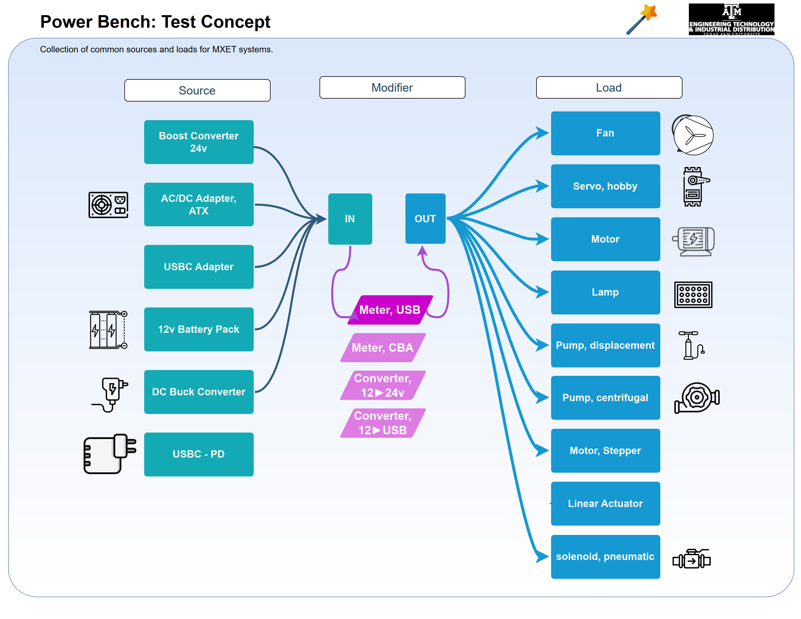
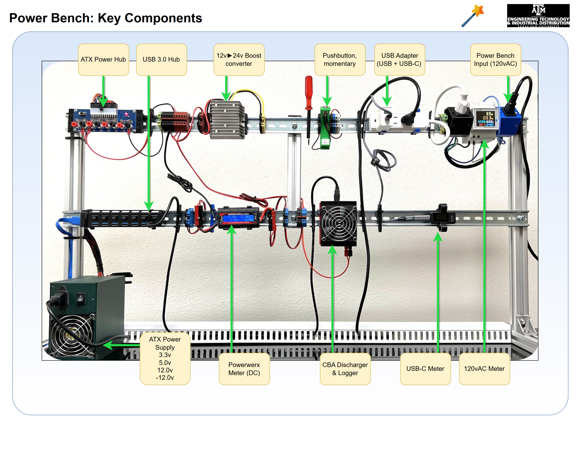
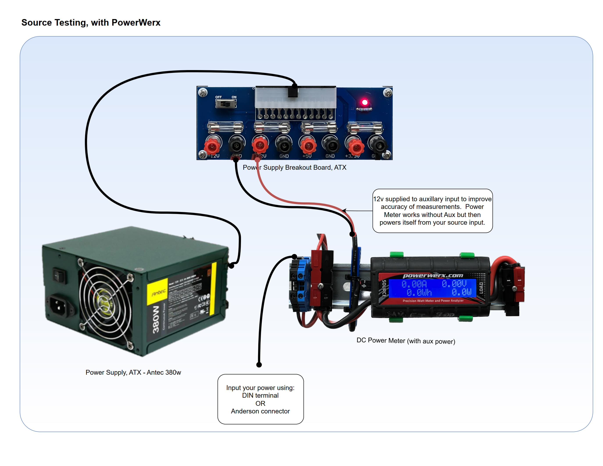

## Power Measurement
We built you a **Power Bench** station for hands-on testing of powered electronics. The Bench includes testers, adapters, power supplies in the power bench that come with their own instructions shared below.  The components are affordable off-the-shelf tech that you might also buy for your project.

This webpage is built around electronics and methods documented essentially in these two key PDF files, [PowerBench-Examples](https://github.com/MXET/resources/blob/52e25d3daa446509823e69ba1ae855bc5f3c8c2d/doc/2024_PowerBench_Examples.pdf) and [PowerBench-Documentation](https://github.com/MXET/resources/blob/52e25d3daa446509823e69ba1ae855bc5f3c8c2d/doc/2024_PowerBench_Documentation.pdf)  It's all designed so you _do not need to know the whole system_ and you can simply use one module and benefit.

### Test Bench

For design teams to evaluate electronics & hardware power delivery, consumption, and storage.  Use the provided equipment to set up your own experiment, to measure:
1) How much power does my device use in different operating conditions?
2) Can I source power from my embedded board for an array of sensors?
3) Which battery capacity is necessary to run my system for 1 hour?

Beyond this, discover answers in your troubleshooting:
1) Is my USB cable delivering the expected voltage level?
2) Does my battery voltage drop too low when I am drawing current?
3) Is there a loss of voltage or current in my power converter?

Problems that were solved using the bench (examples):
1) A raspberry Pi resets during operation when a camera or sensor is activated.
2) The battery has sufficient capacity but the voltage is lower than expected during operation.
3) The brushless motor generates noise that interrups our signal lines.

### Hardware

   _CAD Design files: STL to print, SOLIDWORKS to modify, or STEP to build assemblies in your own CAD software_

  * [DIN rail](https://grabcad.com/library/din-rail-36 "din rail model"), an industrial building block for electronics
  * [DIN brackets](https://grabcad.com/library/compliant-din-brackets-1 "DIN Bracket designs"), 3D-Printed and easily customize
  * [Extrusions](https://grabcad.com/library/extrusion-variants-3030-1), 30x30mm for building frames.

 ### Instruments

| Utility | Device | Link or PDF |
| ------- | ------ | ----------- |
| Power Supply, 600W | Power supply, ATX | [GX2 User Manual](https://www.thermaltakeusa.com/toughpower-gx2-600w.html) |
| Power Supply, USB 120w | 818H GaN hub |  [USB Power Supply - PDF](https://qr.page/g/51rwPdnPbKS) |
| Test & log loads | CBA by West Mountain Radio | [CBA IV User Manual](https://qr.page/g/2Gbm5eF5LD9) PDF |
| Test battery capacity | CBA by West Mountain Radio | [CBA IV User Manual](https://qr.page/g/2Gbm5eF5LD9) PDF |
| Power Meter, DC, 45A | Powerwerx | [Power Meter Manual](https://qr.page/g/40KLe1ff1lB) |
| Power Meter, AC | Amazon Product | [Power Meter, AC](https://qr.page/g/2Gz7zQ1hXL5) PDF |
| Power Meter, USB-C | Amazon Product | [Power Meter, USB-C](https://qr.page/g/2fG6cJvZi27) PDF |
  
### Components

  * [USB-C Breakout](https://www.amazon.com/gp/product/B09KC1SMGD), on amazon
  * [USB-C PD Trigger](https://www.amazon.com/gp/product/B0B688HK9S) on amazon.
  * [Power Breakout, ATX](https://www.amazon.com/gp/product/B07S91NQL3) on amazon. 

### Software

  Get Software  
  _Software is only necessary if you wish to use the CBA (computerized battery analyzer)_

 * [CBA IV Power Analyzer](https://www.westmountainradio.com/kb_view_topic.php?id=OT39), ► grab software for model IV

### Instructions

* [PDF index](https://qr.page/g/2fG6cJvZi27) breaks down instructions
* [PDF queries](https://qr.page/g/1FG90ytGtOp) shows what you can test
* [PDF Example Results](https://qr.page/g/LcfYDDoNz6) shows example results
* [Video - Power Budgeting](https://qr.scuttlerobot.org/g/RkNMzfI67w) an introduction to creating a power budget (advanced).

## Batteries
Updated 2025.11. We have a PDF document to give a sense of battery capacity, with three great example choices for projects, and lots of data.  What does a Watt-hour feel like?  How does it translate into tool runtime?  How much max power do you need for different applications?  What terminal choice will connect your power, easily connect, and fit the amperage you need?  Download the PDF below for an introduction - this is from 10 years of battery exploration by David M. Next, this section is for proper handling of li-ion cells in the SCUTTLE Robot battery pack used in MXET300.  The CAD model includes every component for BMS, Cells, and Output.  The notes also serve for general use of li-ion batteries and charging.

* [Battery Design PDF](https://lobfile.com/file/yEMP228Y.pdf)
* [SCUTTLE Battery Model](https://grabcad.com/library/batterypackv3-1)

  
### Terminology:
SOC = state of charge
BMS = battery management system
3S = 3 cells in series
3C = the letter "c" indicates "amperage at which a battery drains in 1 hour" where most typical discharge tests center around 1C

### Cautions
The batteries are the part of the robot with the most frequent failures due to mistreatment.

The battery may be charged with any 12v power supply as the BMS will prevent excessive current.  Or, cells can be removed and charged in an off-the-shelf 18650 battery charger, for Lithium Ion Cells.

If you need to remove cells, remove them carefully and evenly so the cosmetic wrap does not tear!

When charging, the onboard battery management system (BMS) protects the cells from overcurrent. However, if the input current exceeds around 10A momentarily, the BMS will disconnect current and needs disconnection of charger to reset.  

### Charging from low SoC:

If you allow cells to drop down to low voltage (around 9.0v total) then the initial charging current may be high, and trip the BMS safety.  At low voltages, start your charging with a power supply that limits voltage (ie 10v) or limits current (ie 6A).

These cells are rated TRULY, over 3000 mAh from Panasonic - they are a leading model number in the market and not easy to order small quantities, so take care of cells at all times!

### Helpful features: 
You can charge this battery and operate your robot at the same time!  Connect your power supply to one terminal pair while running your CPU from the other terminal pair, for use cases like testing software and reading sensors, and operating the Pi for long periods.

You may check the cells by multimeter at any time (probe + and - of one cell's terminals) to verify the voltage.  There is no need to remove the cells for measurement. Cells should be balanced within 0.2 volts across the 3 cells.

You can safely charge the batteries with various reasonable sources such as 12v solar panel or a larger battery, provided the current does not exceed shutoff-threshold.  BMS shutoff does not cause damage – test your setup with good engineering planning.

The BMS offers max-voltage shutoff as well, around 14v.  If the input voltage is too high (such as fluctuating solar panel) then the BMS will shut off regardless of current.

### Damaged Cells:

If a cell has a low voltage, it is irreparably damaged.  They may survive as low as 2.8 volts momentarily but if stored below 2.8 volts you can trust the cell is ready for the recycle bin.

## Power Budget

An introduction to creating a power budget. This is oriented to systems that are battery operated, rather than plugged into a wall.  That is, DC systems rather than AC, and using usual electronics voltages such as 5v (USB), 12v (car battery), and 3.3v (digital signal levels)

* PDF Template for MXET [Power budget](https://qr.page/g/3fLXXbQFdPo)
* Excel Template for MXET [Power budget](https://lobfile.com/file/M2Qt.xlsx)

### Instructional Videos

**Test Power for anything with just 3 Devices**
[view on youtube](https://youtu.be/s4Syzco1ziM)
<iframe width="1250" src="https://www.youtube.com/embed/s4Syzco1ziM" title="3 Ways to test Power Draw for mechatronics designs" frameborder="0" allow="accelerometer; autoplay; clipboard-write; encrypted-media; gyroscope; picture-in-picture; web-share" referrerpolicy="strict-origin-when-cross-origin" allowfullscreen></iframe>

**How to Make a Power Budget**
[youtube - power budgeting](https://youtu.be/DKPFsVOTJpw)
<iframe width="1317" height="741" src="https://www.youtube.com/embed/DKPFsVOTJpw" title="Power Budget Explained [Mechatronics Capstone Projects]" frameborder="0" allow="accelerometer; autoplay; clipboard-write; encrypted-media; gyroscope; picture-in-picture; web-share" referrerpolicy="strict-origin-when-cross-origin" allowfullscreen></iframe>

**Use our Power Bench**
Images below show the key information you need to get started, and how the test bench works.

* 
* 
* 
* 

## Power Measurement
We built you a **Power Bench** station for hands-on testing of powered electronics. The Bench includes testers, adapters, power supplies in the power bench that come with their own instructions shared below.  The components are affordable off-the-shelf tech that you might also buy for your project.

### Power Bench Design

  
Software

  Get Software  
  _Software is only necessary if you wish to use the CBA (computerized battery analyzer)_

 * [CBA IV Power Analyzer](https://www.westmountainradio.com/kb_view_topic.php?id=OT39), ► grab software for model IV
 

  
Hardware

   _CAD Design files: STL to print, SOLIDWORKS to modify, or STEP to build assemblies in your own CAD software_

  * [DIN rail](https://grabcad.com/library/din-rail-36 "din rail model"), an industrial building block for electronics
  * [DIN brackets](https://grabcad.com/library/compliant-din-brackets-1 "DIN Bracket designs"), 3D-Printed and easily customize
  * [Extrusions](https://grabcad.com/library/extrusion-variants-3030-1), 30x30mm for building frames.
 

 

  
  
Instruments

| Utility | Device | Link or PDF |
| ------- | ------ | ----------- |
| Power Supply, 600W | Power supply, ATX | [GX2 User Manual](https://www.thermaltakeusa.com/toughpower-gx2-600w.html) |
| Power Supply, USB 120w | 818H GaN hub |  [USB Power Supply - PDF](https://qr.page/g/51rwPdnPbKS) |
| Test & log loads | CBA by West Mountain Radio | [CBA IV User Manual](https://qr.page/g/2Gbm5eF5LD9) PDF |
| Test battery capacity | CBA by West Mountain Radio | [CBA IV User Manual](https://qr.page/g/2Gbm5eF5LD9) PDF |
| Power Meter, DC, 45A | Powerwerx | [Power Meter Manual](https://qr.page/g/40KLe1ff1lB) |
| Power Meter, AC | Amazon Product | [Power Meter, AC](https://qr.page/g/2Gz7zQ1hXL5) PDF |
| Power Meter, USB-C | Amazon Product | [Power Meter, USB-C](https://qr.page/g/2fG6cJvZi27) PDF |
  

  
  
Electronics Accessories

  * [USB-C Breakout](https://www.amazon.com/gp/product/B09KC1SMGD), on amazon
  * [USB-C PD Trigger](https://www.amazon.com/gp/product/B0B688HK9S) on amazon.
  * [Power Breakout, ATX](https://www.amazon.com/gp/product/B07S91NQL3) on amazon. 
  

### Power Bench Instructions

* [PDF index](https://qr.page/g/2fG6cJvZi27) breaks down instructions
* [PDF queries](https://qr.page/g/1FG90ytGtOp) shows what you can test
* [PDF Example Results](https://qr.page/g/LcfYDDoNz6) shows example results
* [Video - Power Budgeting](https://qr.scuttlerobot.org/g/RkNMzfI67w) an introduction to creating a power budget (advanced).
